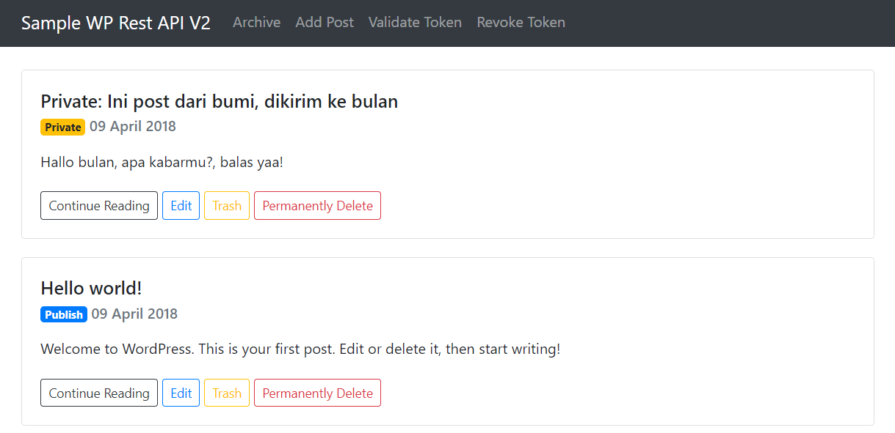

# WordPress Rest API APP

A Standalone Sample WordPress Rest API application with PHP

More about WordPress Rest API, visit: https://developer.wordpress.org/rest-api/

## Requirement on WordPress site

`#1` WordPress version 4.7 or later

`#2` Installed plugin **JWT Authentication for WP-API**

`#3` Installed plugin **ACF to REST API**

`#4` Installed plugin **Advanced Custom Fields**

`#5` Use file `acf-fields.php` on this repo to generate required ACF fields

### Enable auth header

Add below lines to the bottom of the `.htaccess` file

```
# BEGIN WordPress JWT Auth
<IfModule mod_rewrite.c>
RewriteCond %{HTTP:Authorization} ^(.*)
RewriteRule ^(.*) - [E=HTTP_AUTHORIZATION:%1]
SetEnvIf Authorization "(.*)" HTTP_AUTHORIZATION=$1
</IfModule>
# END WordPress JWT Auth
```

### JWT Authentication secret key

Add below lines to file `wp-config.php`

```
/** JWT_AUTH */
define('JWT_AUTH_SECRET_KEY', 'replace me with wordpress's salt string');
```

### Set ACF to Rest API to request version 3

Add below line to file theme `functions.php`

```
define( 'ACF_TO_REST_API_REQUEST_VERSION', 3 );
```

## Options Available

Set the WordPress site url and cookies timeout on file `wp-rest-api-app.php`

```
function __construct() {
	$this->site = 'http://localhost/wp-site/';
	$this->timeout_time = time() + 60 * 60 * 24 * 30; // 30 days
}
```

## Screenshot

